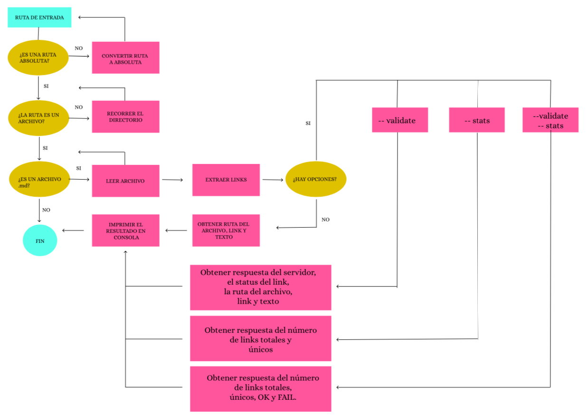

# Markdown Links

**Markdown** es un tipo de lenguaje de marcado ligero, muy popular entre desarrolladores. 
Un ejemplo de este tipo de archivos es el tradicional **README.md** que se encuentra en nuestros repositorios de Github. 

Los archivos Markdown contienen varios links y muchas veces varios de ellos se encuentran rotos o ya no son válidos y eso perjudica el valor de lo que se quiere compartir. 

La presente propuesta es una herramienta desarrollada en **Node.js** que lee y analiza archivos en formato **.md** y nos retorna el estatus del link y
estadísticas de los mismos. 

## Diagrama de flujo

Se muestra el diagrama de flujo que contiene el algoritmo para la solución del problema anterior.



## Documentación Técnica de la Libreria

| Especificaciones Técnicas       | 
| --------------------------------|
| **Lenguaje**                    |
| JavaScript                      |
| **Dependencias**                |
|                                 |
|                                 |
| **Otros**                       |
|                                 |
|                                 |
|                                 |
|                                 |
|                                 |

## Guía para la instalación de la librería 

## Guía de Uso 

## Autor

* Rosa Isela López Palma

## 10. Checklist

### General

- [ ] Puede instalarse via `npm install --global <github-user>/md-links`

```sh
$ md-links ./some/example.md --stats --validate
Total: 3
Unique: 3
Broken: 1
```