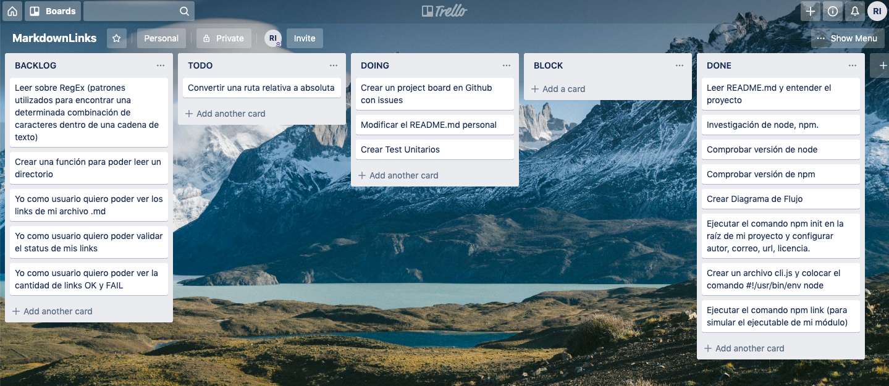
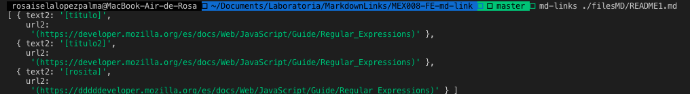
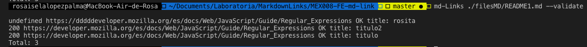

# Markdown Links

**Markdown** es un tipo de lenguaje de marcado ligero, muy popular entre desarrolladores. 
Un ejemplo de este tipo de archivos es el tradicional **README.md** que se encuentra en nuestros repositorios de Github. 

Los archivos Markdown contienen varios links y muchas veces varios de ellos se encuentran rotos o ya no son válidos y eso perjudica el valor de lo que se quiere compartir. 

La presente propuesta es una herramienta desarrollada en **Node.js** que lee y analiza archivos en formato **.md** y nos retorna el estatus del link. 

## Diagrama de flujo

Se muestra el diagrama de flujo que contiene el algoritmo para la solución del problema anterior.

## Trello 

A continuación se encuentra el tablero kanban ideado para la realización del proyecto

## Documentación Técnica de la Libreria

|    Librería construida con:        | 
|    --------------------------------|
|    **Lenguaje**                    |
|    JavaScript                      |
|    **Ejecución**                   |
|    Node.js                         |
|    **Módulos de node**             |
|    Fyle System 'fs'                |
|    http.get                        |
|    https.get                       |
|    Path                            |
|    **Dependencias**                |
|    ESLint                          |
|    Jest                            |
|    **Otros**                       |
|    module.exports                  |
|    RegEx                           |
|    CLI Command Line Interface      |

## Guía para la instalación de la librería 
Utiliza el comando `npm install --global <github-user>/md-links` para instalar la librería. 
Considera que es necesario tener instalado node globalmente para ejecutar la instalación de la librería anterior.

## Guía de Uso 
Utiliza el comando `md-links` más el nombre del archivo .md de tu interés,para usar la librería. 
Ejemplo: `md-links ./README.md`
Con el comando anterior podrás obtener un arreglo de objetos con todos los links que se encuentren en el archivo escaneado.

También puedes validar los links con la opción **--validate**.
Ejemplo: `md-links ./README.md --validate`
Los links funcionales aparecerán con la palabra OK.

## Autor

* Rosa Isela López Palma

